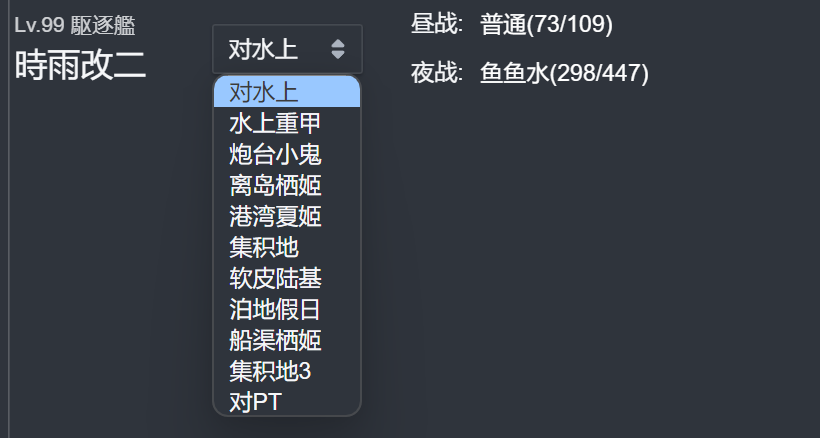
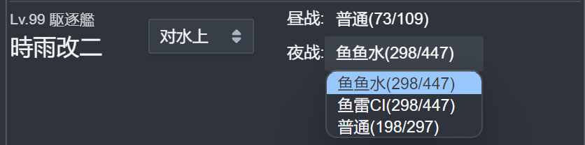

# Attack Power Calculator

Attack Power Calculator is a poi plugin that calculate final attack power before enemy armor and ammunition bonus.

Choose fleet type:  
  
Choose enemy type and calculate attack power:  
  
Click to show different attack type(like cut-in).  
  

## Changelog

### 0.0.3
Fix bug: night aircraft.

### 0.0.2
Add readme and change layout.

### 0.0.1
Basic functions.
